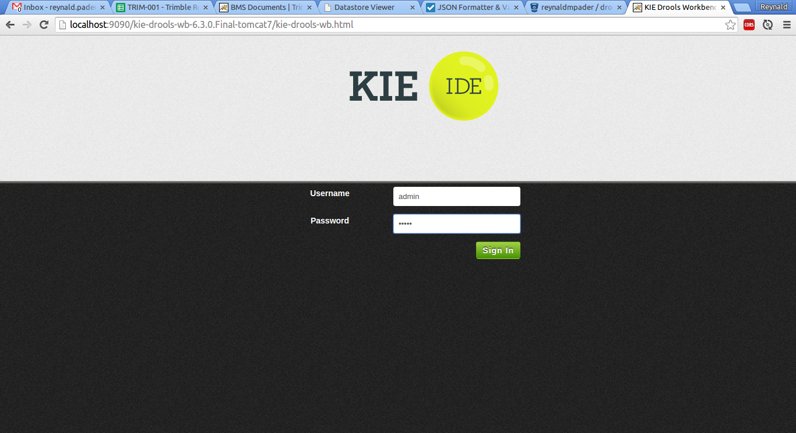

Drools Demo
===

Course planner application for demonstrating Drools use-cases and configuration. Current configuration assumes a central
rules repository (Drools Workbench) what will contain the rules and can be configured at runtime.

## `drools-demo-facts`
Contains classes that are needed in authoring rules. This artifact is imported into the workbench to be able to
reference fact classes.

## `drools-demo-app`
The actual application for the course planner.

### Setup Tomcat
Download this [repacked Tomcat 8](https://www.dropbox.com/s/9makqnl9hd5dmp5/apache-tomcat-8.tar.gz?dl=0) container pre-configured for Drools Workbench.

1.  Extract to desired location
2.  Set `CATALINA_HOME` environment variable (`.profile`) to the location of the container
3.  Set `JAVA_JOME` environment variable (`.profile`) to your JDK location
4.  Go to `$CATALINA_HOME/bin`
5.  Run `startup.sh` to run
6.  Run `shutdown-drools-wb.sh` to shutdown

### Setup Drools Workbench
Download the [Drools Workbench 6.3.0.Final](http://download.jboss.org/drools/release/6.3.0.Final/kie-drools-wb-6.3.0.Final-tomcat7.war).
This version is chosen to match the version of the project dependency.

1.  Go to [Tomcat Manager](http://localhost:9090/manager/html/).
2.  Scroll to `WAR file to deploy` section and choose the downloaded Workbench WAR file.
3.  Click `deploy`.
4.  Test the deployment by logging into the [Workbench](http://localhost:9090/kie-drools-wb-6.3.0.Final-tomcat7) with "admin/admin"


### Setup a Drools Project
Before going any further, make sure you install the `drools-demo-facts` artifact. 

In the `drools-demo-facts` folder:

```
$ mvn clean install
```

This will create an artifact in your local maven repository (usually located at `~.m2/repository/com/cloudsherpas/drools-demo/{version}/{artifactId}.jar`).
Take note of this location because you will be uploading this particular JAR file in the workbench later. Also, make sure 
to remember that each time you change the facts artifact dependency in your project, it is advisable to also upload the new artifact in the workbench.
Lastly, as much as possible, only upload RELEASED versions of your facts artifact. Using SNAPSHOTS are dangerous because 
those artifacts could change without notice.

Now setup a Drools Project in the Workbench.

*  Log-in as admin/admin in the workbench



*  Go to the artifact repository and upload the facts artifact JAR file generated earlier:


*  In the **Authoring > Administration** page:


    
*  Create a new organizational unit:
    

    
and a repository for the new Organizational Unit:


*  Go to Project Authoring:


*  Create a project:


*  Create a new Drool file (New Item > DRL file) with the contents of `course_suggestion.drl`. The package declaration must stay as what is generated by the workbench:


Make sure to click on **Validate** before saving the file you will notice that some errors will pop-up. This is because we haven't added the dependencies for the facts yet.

*  Open the Project Editor and go to the dependencies section:


*  Click "Add from repository" and select the uploaded JAR file from the first step.


*  Go back to your DRL file and click on validate again. There should be no more error pertaining to unresolved classes.

*  Click "Build & Deploy" to rules and get the download link.


*  Find `RulesConfig.java` in `drools-demo-app` and change the URL to the download URL from the previous step
*  Update the release ID in `RulesConfig.java` to the correct information of your Drools Project

## How to run
In the `drools-demo-app` folder:
    
```
$ mvn spring-boot:run
```

    
## Testing
Use [Postman](https://chrome.google.com/webstore/detail/postman/fhbjgbiflinjbdggehcddcbncdddomop?hl=en) to interact with
the API.

Sample GET request:
    http://localhost:8081/course/suggest?math=7&software=10&electronics=5&arts=10&social_studies=7